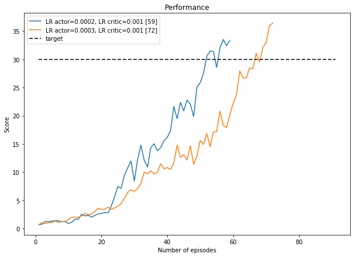

# Report

###  The environment
In this environment, the goal is to train arms to track moving balloons. A reward of +0.1 is given at each step that the agent's hand is at the correct location next to the moving balloon.

Deep Deterministic Policy Gradients (DDPG) were used to solve this environment. The original DDPG agent code was modified to work with 20 identical agents working in parallel. Because there are 20 agents running in parallel instead of only 1, the algorithm is able to learn at a much faster rate.

To calculate the score at each episode, the rewards of each of the 20 agents are aggregated to obtain a score for each agent, and then these 20 agent scores are averaged to provide a single value. The environment is considered solved when this score is above 30.0.

### Deep Deterministic Policy Gradients (DDPG)

DDPG is an algorithm that solves an issue of working with continuous rather than discrete action spaces when it comes to working with the DQN algorithm, and is a type of actor-critic algorithm. 

#### Actor-critic methods
Actor critic methods are at the intersection of value-based methods and policy-based methods, where the idea is to use value-based techniques to reduce the variance of policy based methods.

DDPG is, however, slightly different to typical actor critic models, because the critic is used to approximate the maximiser over the q-values over the next state, and not as a learned baseline.

In DDPG, there are two deep neural networks; the actor, and the critic. The actor is used to appoximate the optimal policy deterministically (*always* outputs the best believed action for any given state, as opposed to a stochastic policy where a probabilty distribution is learned over all the possible actions). Meanwhile, the second deep neural network, the critic, learns to evaluate the optimal action value function by using the actor's best believed action.

The actor, therefore, is an approximate maximiser to calculate a new target value for training the action value function.

#### The replay buffer and soft updates to the target networks
Like with other reinforcement learning algorithms, DDPG also uses a replay buffer, but it differs from algorithms like DQN with strategies like soft updates.

In DQN there are two copies of the network weights; the regular and the target network. The target network is updated after a long number of time steps (eg, 10,000) whereby the weights of the regular network are copied over to the target network. In other words, the target network is fixed for the number of specified time steps, and then gets a large update.

In DDPG, there are two copies of the network weights; 2x copies of the regular network weights for the actor and the critic, and 2x copies of the target network for the actor and the critic. Here, the weights are updated with a *soft update* strategy, where the regular network weights are slowly blended with the target network weights. This means that at every time step, the target network weights will be 99.99% (or what is set by the tau hyperparameter) of the previous target network weights, and 0.01% of the newly-updated regular network weights.

In practice, soft updates produce convergence at a faster rate than only updating after a large number of time steps. It is worth noting that the soft update strategy can be used on all algorithms where there are regular and target networks, meaning that it is possible to also use this strategy on DQN.

### Imports


```python
import os
import pandas as pd
import numpy as np
from IPython.display import display
import matplotlib.pyplot as plt
%matplotlib inline
```

### Functions


```python
def extract_info_from_file_name(s):
    
    d = {}
    items = s.replace('.csv', '').split(',')
    for item in items:
        if '__' not in item:
            d['timestamp'] = item
        else:
            k, v = item.split('__')
            d[k] = v
            
    return d
```

### Load runs


```python
runs_dir = '../runs'
runs = os.listdir(runs_dir)
runs = [item for item in runs if '.' not in item] # remove the markdown file
```


```python
runs_info = []
runs_data = []
```


```python
counter = 0
for run in runs:
    run_dir = os.path.join(runs_dir, run)
    files = os.listdir(run_dir)
    
    if len(files) > 0:
        try:
            csv_file_name = [f for f in os.listdir(run_dir) if '.csv' in f][0]

            # extract the summary information
            info_dict = extract_info_from_file_name(csv_file_name)
            info_dict['id'] = counter
            runs_info.append(info_dict)

            # save scores data to df
            df = pd.read_csv(os.path.join(run_dir, csv_file_name))
            df.rename(columns={'episode_score':counter}, inplace=True)
            df.set_index('episode_number', inplace=True)
            runs_data.append(df)

            counter += 1
            
        except:
            pass
```


```python
summary_data = pd.DataFrame(runs_info)
score_data = pd.concat(runs_data, sort=False, axis=1, ignore_index=True)

for col in ['gamma', 'lr_actor', 'lr_critic', 'tau']:
    summary_data[col] = summary_data[col].astype(float)
    
for col in ['batch_size', 'buffer_size', 'id', 'max_t', 'n_episodes', 'solved_in']:
    summary_data[col] = summary_data[col].astype(int)
```

### Summary of scores


```python
display(summary_data.sort_values(by='solved_in'))
```


<div>
<style scoped>
    .dataframe tbody tr th:only-of-type {
        vertical-align: middle;
    }

    .dataframe tbody tr th {
        vertical-align: top;
    }

    .dataframe thead th {
        text-align: right;
    }
</style>
<table border="1" class="dataframe">
  <thead>
    <tr style="text-align: right;">
      <th></th>
      <th>batch_size</th>
      <th>buffer_size</th>
      <th>gamma</th>
      <th>id</th>
      <th>lr_actor</th>
      <th>lr_critic</th>
      <th>max_t</th>
      <th>n_episodes</th>
      <th>solved_in</th>
      <th>tau</th>
      <th>timestamp</th>
      <th>weight_decay</th>
    </tr>
  </thead>
  <tbody>
    <tr>
      <th>0</th>
      <td>128</td>
      <td>100000</td>
      <td>0.99</td>
      <td>0</td>
      <td>0.0002</td>
      <td>0.001</td>
      <td>1000</td>
      <td>2000</td>
      <td>59</td>
      <td>0.001</td>
      <td>201812202223</td>
      <td>0</td>
    </tr>
    <tr>
      <th>1</th>
      <td>128</td>
      <td>100000</td>
      <td>0.99</td>
      <td>1</td>
      <td>0.0003</td>
      <td>0.001</td>
      <td>1000</td>
      <td>2000</td>
      <td>72</td>
      <td>0.001</td>
      <td>201812202252</td>
      <td>0</td>
    </tr>
    <tr>
      <th>2</th>
      <td>128</td>
      <td>100000</td>
      <td>0.99</td>
      <td>2</td>
      <td>0.0002</td>
      <td>0.001</td>
      <td>1000</td>
      <td>2000</td>
      <td>91</td>
      <td>0.001</td>
      <td>201812210709</td>
      <td>0</td>
    </tr>
  </tbody>
</table>
</div>


```python
score_data['target'] = 30.0
score_data.reset_index(drop=True, inplace=True)
score_data['n_episodes'] = score_data.index+1
```


```python
display(score_data.head())
```


<div>
<style scoped>
    .dataframe tbody tr th:only-of-type {
        vertical-align: middle;
    }

    .dataframe tbody tr th {
        vertical-align: top;
    }

    .dataframe thead th {
        text-align: right;
    }
</style>
<table border="1" class="dataframe">
  <thead>
    <tr style="text-align: right;">
      <th></th>
      <th>0</th>
      <th>1</th>
      <th>2</th>
      <th>target</th>
      <th>n_episodes</th>
    </tr>
  </thead>
  <tbody>
    <tr>
      <th>0</th>
      <td>0.6985</td>
      <td>0.7065</td>
      <td>0.5610</td>
      <td>30.0</td>
      <td>1</td>
    </tr>
    <tr>
      <th>1</th>
      <td>0.7870</td>
      <td>1.0380</td>
      <td>0.5275</td>
      <td>30.0</td>
      <td>2</td>
    </tr>
    <tr>
      <th>2</th>
      <td>1.2680</td>
      <td>0.8965</td>
      <td>1.0145</td>
      <td>30.0</td>
      <td>3</td>
    </tr>
    <tr>
      <th>3</th>
      <td>1.2055</td>
      <td>1.0570</td>
      <td>0.9015</td>
      <td>30.0</td>
      <td>4</td>
    </tr>
    <tr>
      <th>4</th>
      <td>1.3505</td>
      <td>1.0720</td>
      <td>0.8965</td>
      <td>30.0</td>
      <td>5</td>
    </tr>
  </tbody>
</table>
</div>


```python
# run_ids = summary_data['id'].unique()
run_ids = [0, 1]
```

### Plot performance


```python
t = 'Performance'

fig, ax = plt.subplots(nrows=1, ncols=1, figsize=(10,7))

for e_id in run_ids:
    scores = score_data[e_id]
    n_episodes = score_data['n_episodes']
    target_score = score_data['target']
    
    # legend data
    gamma_value = summary_data[summary_data['id'] == e_id]['gamma'].values[0]
    lr_actor_value = summary_data[summary_data['id'] == e_id]['lr_actor'].values[0]
    lr_critic_value = summary_data[summary_data['id'] == e_id]['lr_critic'].values[0]
    max_t_value = summary_data[summary_data['id'] == e_id]['max_t'].values[0]
    tau_value = summary_data[summary_data['id'] == e_id]['tau'].values[0]
    weight_decay_value = summary_data[summary_data['id'] == e_id]['weight_decay'].values[0]
    solved_value = summary_data[summary_data['id'] == e_id]['solved_in'].values[0]
    
    ax.plot(n_episodes, scores, label='LR actor={}, LR critic={} [{}]'.format(lr_actor_value, lr_critic_value, solved_value))

ax.plot(n_episodes, target_score, label='target', color='black', dashes=[4, 2])

plt.ylabel('Score')
plt.xlabel('Number of episodes')
plt.title(t)
plt.legend()
```


    <matplotlib.legend.Legend at 0x1f742d3a5f8>





### Summary and future improvements

I found the algorithm to be very sensitive to changes in the hyperparameters, and if I increased the learning rate for the actor or critic too high the environment wouldn't solve at all.

Nevertheless, when the hyperparameters were set to reasonable values the algorithm was able to solve the environment in a quick and stable manner, showing DDPG to be a powerful algorithm to use. With a learning rate of 0.0002 for the actor and a learning rate of 0.001 for the critic the algorithm was able to solve the environment in 59 episodes. I would like to experiment with altering other parameters and observing how these impact on the model's ability to learn an optimal policy.

I also tried altering the architecture of the two hidden layer fully connected neural network (from 400/300 neurons, to 500/250) which had an adverse impact on training time. However, I'm sure devoting some time to exploring different neural network architectures could improve performance, including by adding a third hidden layer to the network.

I would also like to try PPO (proximal policy optimization) to see how that performs on the task.
