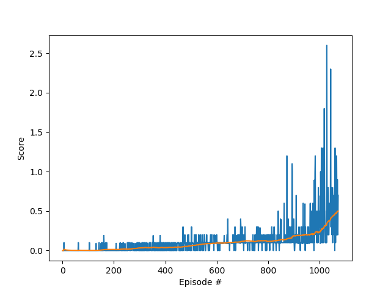

# Report

### The environment

The environment in this project is Unity's [Tennis](https://github.com/Unity-Technologies/ml-agents/blob/master/docs/Learning-Environment-Examples.md#tennis) environment.

In this environment, two agents control rackets to bounce a ball over a net. If an agent hits the ball over the net, it receives a reward of +0.1. If an agent lets a ball hit the ground or hits the ball out of bounds, it receives a reward of -0.01. Thus, the goal of each agent is to keep the ball in play.

The observation space consists of 8 variables corresponding to the position and velocity of the ball and racket. Each agent receives its own, local observation. Two continuous actions are available, corresponding to movement toward (or away from) the net, and jumping.

The task is episodic, and in order to solve the environment, your agents must get an average score of **+0.5** (over 100 consecutive episodes, after taking the maximum over both agents). 

Specifically:

- After each episode, we add up the rewards that each agent received (without discounting), to get a score for each agent. This yields 2 (potentially different) scores. We then take the maximum of these 2 scores.
- This yields a single score for each episode.
- The environment is considered solved, when the average (over 100 episodes) of those scores is at least +0.5.

### Multi Agent DDPG

This task is a multi agent problem because there are two agents interacting with each other in the environment.

As each agent is an opponent learning to play the tennis game, and receives a reward each time it hits the ball over the net, both agents need to collaborate as well as compete to maximise the available score at the end of each episode.

For this reason, and that both agents are interacting with the same environment, there is a benefit to setting up the algorithm so that both agents share experiences as well as have the same hyperparameters. This allows them to both learn at similar rates, and by pooling experiences, both should in theory learn at a faster rate.

The algorithm used was DDPG with two agents, with separate actor/critics but a pooled replay buffer.  

### The hyperparameters used

I found that the following settings were able to solve the environment in **1,072 episodes**:

- Buffer size: 300,000
- Batch size: 256
- Gamma: 0.99
- Tau: 6e-2
- Actor learning rate: 1e-3
- Critic learning rate: 1e-3
- Critic weight decay: 0
- Add noise: True
- Update every: 1 episode(s)
- Number of updates each episode: 1
- Epsilon start: 3
- Epsilon end: 0
- Epsilon decay: 0.9999

The neural networks each had two hidden layers with 256 and 128 neurons.

### Summary and future improvements

I found it particularly challenging to get the agents to solve the environment in a short number of episodes because they seemed to need a significant amount of exploration initially in order to learn effectively. If I reduced the amount of exploration by the agents too quickly, the scores would initially improve before falling again (often some way before reaching the 0.5 average score in order to solve the environment). In the end I used a very slow decay so that they continued to explore (at a diminishing rate) for around 1,000 episodes.

The weights were updated after each episode as I found that waiting took the agents far too long to learn. 

Increasing the buffer size from 100,000 to 300,000 seemed to help slightly. 

To further improve on the performance achieved so far, I would like to explore altering the sizes of the hidden layers in the neural networks to see if that improves the speed at which the agents are able to solve the environment.

Also, as I only used a simple experienced replay I would like to see if changing this to prioritized experience replay would speed up training.

